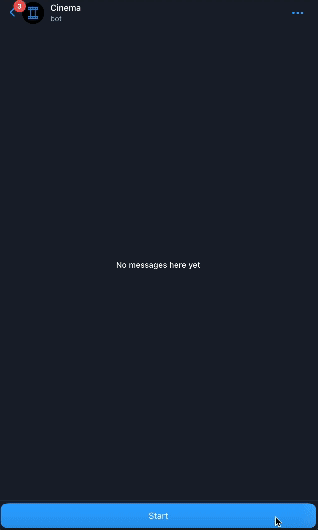

# Mini-app for booking movies
[@CineBookBot](https://t.me/CineBookBot) - Telegram mini app, which is a demo application that provides convenient and easy online cinema booking. It displays available cinema showings with times and remaining seats in the cinema.

## Demo


## Note
For a comprehensive, detailed walkthrough of the app development process, please refer to [STEP-BY-STEP](STEP-BY-STEP.md)

## Stack
##### Client
  - React - [Docs](https://react.dev)
  - Telegram Mini Apps - [Docs](https://core.telegram.org/bots/webapps#implementing-mini-apps)
##### Server
  - NodeJS v18
  - @vkruglikov/react-telegram-web-app - Telegram web app library for react [Docs](https://github.com/vkruglikov/react-telegram-web-app)


## Run

#### Cloning project
 ```
    git clone https://github.com/shurma1/MovieWebApp.git
    cd MovieWebApp
 ```


#### Install depending
Go to backend/ and install depending:
```
npm i
```
Now you need to globally install nodemon to automatically restart the server during development.

```
npm i -g nodemon
```
or
```
sudo npm i -g nodemon
```

#### Configurate server
Go to backend/src and open config.js
```js
const BOT_API_KEY = 'YOUR_BOT_API_KEY'; //<--- Your bot's API token (available from @BotFather)
const HELLO_STIKER_ID = 'CAACAgIAAxkBAAICHGUjmQNID7R9RX7wzjnwwAIR8sULAAJHAANZu_wlXJ3WrE3fYSwwBA';
const HELLO_MESSAGE = 'What movie do you want to watch? Click on the button below and book your tickets.';
const WEB_APP_URL = 'YOUR_WEB_APP_URL';  //<--- Link to your domain (url address where the web application will work)
 
...
```

#### Run server
Go to the backend folder and run server:

prod:
```
npm start
```
dev:
```
npm run dev
```
Telegram bot must be present on messages :)

#### Install frontend depending
Go to client/ and install depending:
```
npm i
```

#### Run frontend
To prepare a project for hosting on your site's server, you need to build a project. Got to client/ and build:
```
npm run build
```
after executing the command, the build folder will appear, its contents need to be transferred to web hosting

###Done


  
